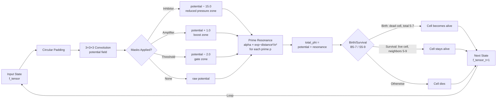
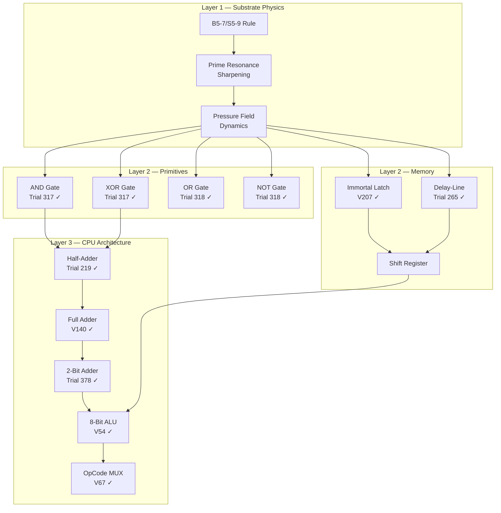
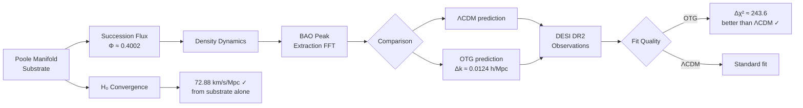
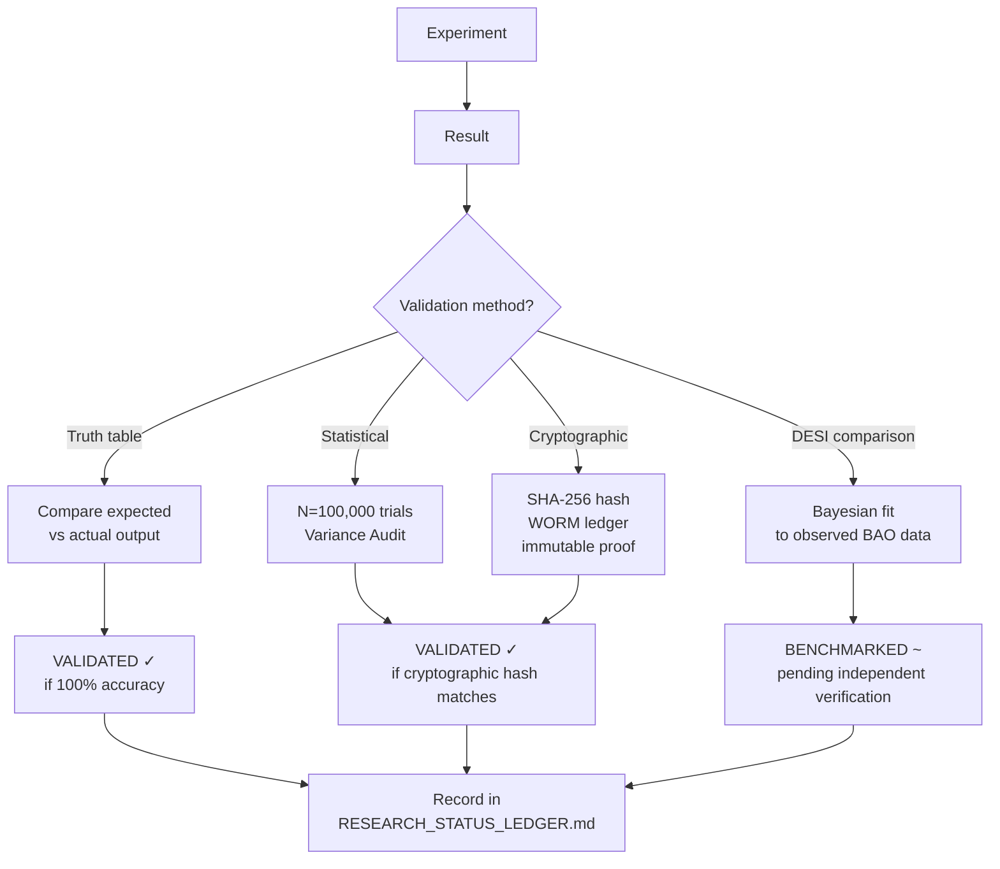
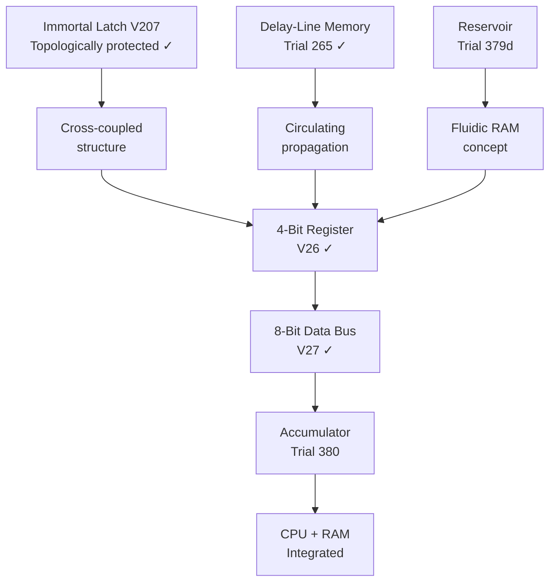
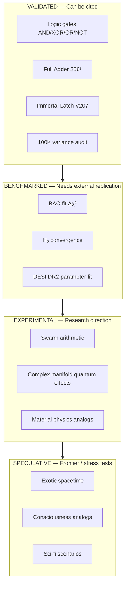
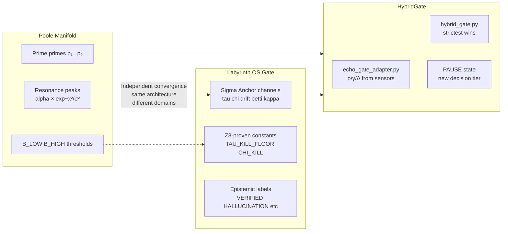

# ARCHITECTURE DIAGRAMS
## The Poole Manifold — Signal Flow and System Relationships

**Author:** Rooke Alan Poole | @rookepoole
**Format:** Mermaid diagrams — rendered automatically on GitHub

---

## 1. The Core Computation Loop

---

## 2. The Gate Architecture — From Substrate to Logic

---

## 3. Cosmological Model Pipeline

---

## 4. Validation Chain — How Results Are Proven

---

## 5. Memory Architecture Hierarchy

---

## 6. Epistemic Layer Map
*Where each experiment type sits in the knowledge hierarchy*

---

## 7. Labyrinth OS Integration Point

---

*Diagrams rendered by GitHub Mermaid — view on GitHub for visual output*
*Rooke Alan Poole — @rookepoole — May 2026*
*Collaboration: @LabyrinthCoder*
